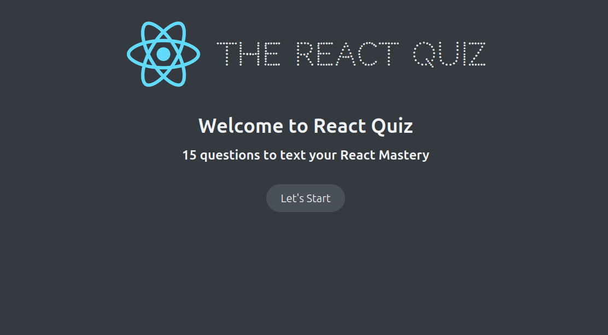
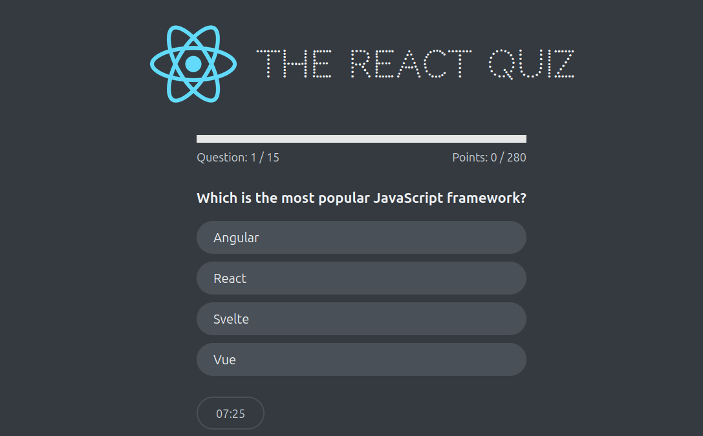
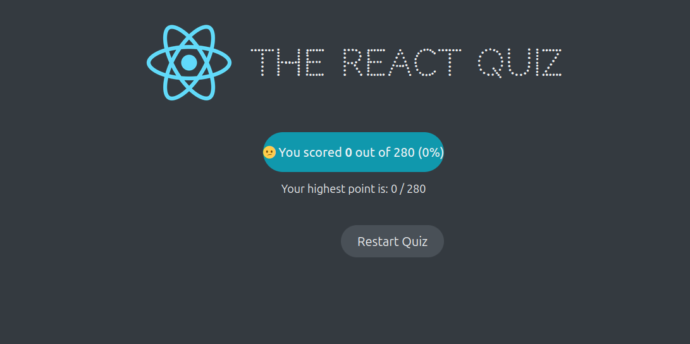

## Application Instructions

### Start the Application

To launch the application, use the following commands:

1. **Start the Backend Server:**  
   Before starting the application, ensure the backend server is running. Use the command:

   ```bash
   npm run server
   ```

   This will launch `json-server`, which serves as the backend for fetching questions from a JSON file.

2. **Start the Application:**  
   Once the backend server is running, start the application by executing:
   ```bash
   npm start
   ```

### Screenshot of the start screen of the application



### Screenshot of the question screen of the application



### Screenshot of the score screen of the application



### Notes

- **Important:** It is essential to start the backend server (`npm run server`) before running the application (`npm start`) to ensure the questions are loaded properly.
- Feel free to fork this repository and modify the code as needed to adapt it to your use case or improve functionality.
